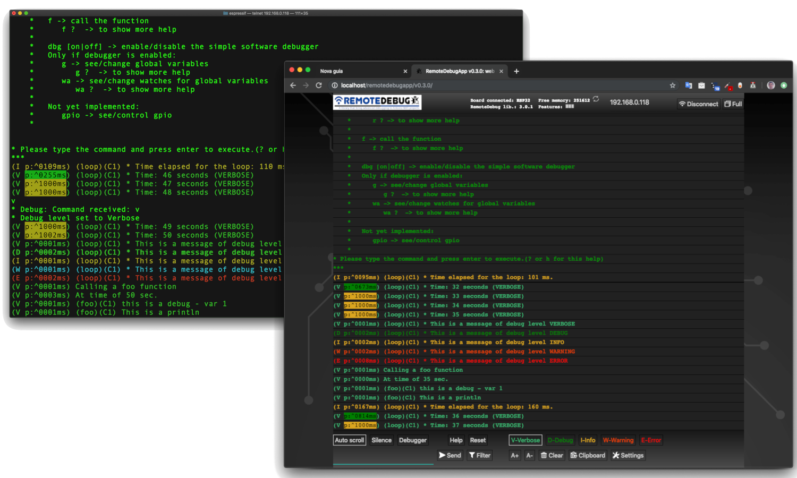
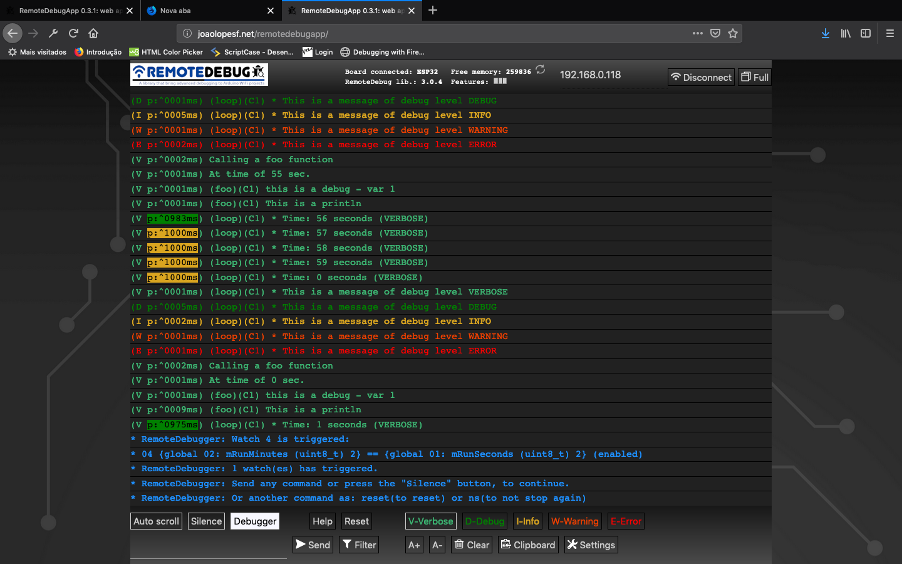
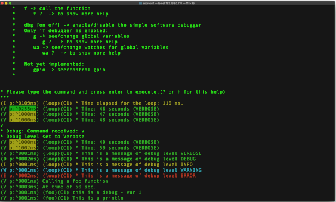
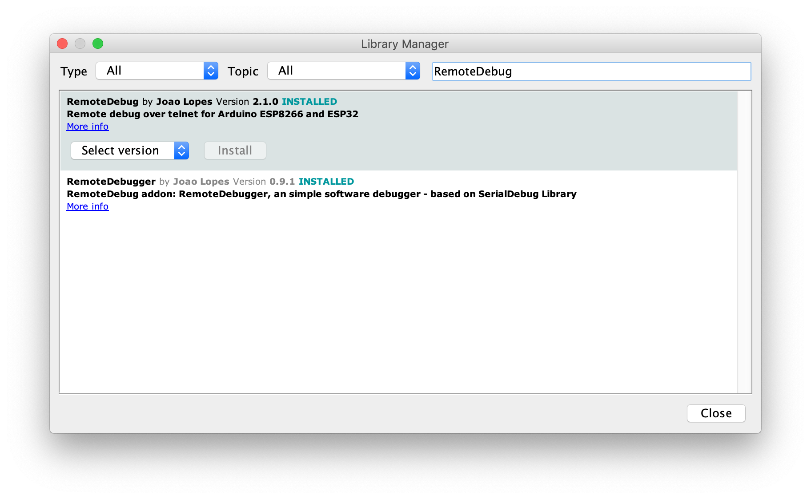

# RemoteDebug Library

A library for Arduino to debug projects over WiFi, with web app or telnet client,
with Print commands like Serial Monitor.


[](https://www.ardu-badge.com/RemoteDebug)
[](#releases)
[](https://www.codacy.com/app/JoaoLopesF/RemoteDebug?utm_source=github.com&amp;utm_medium=referral&amp;utm_content=JoaoLopesF/RemoteDebug&amp;utm_campaign=Badge_Grade)
[](https://github.com/arduino)
[](https://github.com/JoaoLopesF/RemoteDebug/blob/master/LICENSE.txt)  
[](#github)
[](http://github.com/JoaoLopesF/RemoteDebug/issues)
[](http://github.com/JoaoLopesF/RemoteDebug)
<!--  -->



## A library to remotely debug over a WiFi connection by telnet or web browser

### RemoteDebug setup a TCP/IP server, that you connect to debugging, as an alternative to the serial connection

## Contents

- [About](#about)
- [How it looks](#how-it-looks)
- [Github](#github)
- [News](#news)
- [Benefits](#benefits)
- [HTML5 web app](#web-app)
- [Telnet client](#telnet)
- [Wishlist](#wishlist)
- [Install](#install)
- [Using](#usage)
- [Known issues](#known-issues)
- [Releases](#releases)
- [Thanks](#thanks)

## About

By default the Arduino only has as debug possibility via the Serial port.
This has a few disadvantages:

- requires a physical cable to the Arduino device (if the device is far away or in a remote location this is not easy)
- debugging multiple Arduinos at the same time requires many serial ports and a lot of cables

With the ESP8266 (NodeMCU) or ESP32 we now have network connectivity (WiFi) which can be used for streaming debugging information in real-time.

This library is good for IoT projects, home automation, mobile robots (can debug it in moviment with a cable ?) or
another WiFi projects.

In fact, this library was born of a need to debug an IoT project of home automation.
In this project there was a central module and three auxiliary modules,
and these were far from each other. One was hard to reach, under the roof of the house.
To debug this project, accompanying the exchange of messages in realtime,
is impossible to do with traditional way, by USB cable.

The MiP_ESP8266_Library and my ESP32 WiFi robot are example of projects that uses __RemoteDebug__.
See it in:  [MiP_ESP8266_Library](https://github.com/Tiogaplanet/MiP_ESP8266_Library) and [ESPlorer_v1](https://github.com/JoaoLopesF/ESPlorer_v1)

__RemoteDebug__ is improved with client buffering (is last send is <= 10ms),
to avoid mysterious delays of WiFi networking on ESP32 and ESP8266 boards

Note: If your project not use WiFi, you can use my another library,
the __[SerialDebug](https://github.com/JoaoLopesF/SerialDebug)__ library, 
this library works with any Arduino board.

Note II: __RemoteDebug__ library is now only to Espressif boards, as ESP32 and ESP8266,
If need for another WiFi boards, please add an issue about this
and we will see if it is possible made the port for your board.

## How it looks

Image: In RemoteDebugApp (web app)



Image: In telnet client



Youtube (RemoteDebug v2):

[](https://youtu.be/T4nxdsFUGgg)

Youtube (3 telnet connections with RemoteDebug) v1:

[](http://www.youtube.com/watch?v=lOo-MAD8gPo)

## Github

Contribute to this library development by creating an account on GitHub.

Please give a star, if you find this library useful,
this help an another people, discover it too.

Please add an issue for problems or suggestion.

## News

- RemoteDebugApp Beta

  - Now have another repository, [RemoteDebugApp](https://github.com/JoaoLopesF/RemoteDebugApp)
    It is for local copy of web app in internet.
    It is updated with lastest version of web app,
    after it is publised in web server: [http://joaolopesf.net/remotedebugapp](http://joaolopesf.net/remotedebugapp/).
    Download it, for use when internet is offline.
    As it is a local copy, the app will check for new versions periodically.

  - An HTML5 web app to use for debugging in web browser, instead telnet client,
    that uses web socket to comunicate.

  - Now RemoteDebug v3 have a web socket server too,
    to support the RemoteDebugApp connection.

  - RemoteDebugApp is in beta,
    if you have any problems or suggestions, please add issue about this.

  - The telnet connection remains, to any want this,
    or to internet offline uses.

- Version 2.1.1

  - Now __RemoteDebug__ have a code converter, for help you to convert your codes:
    to do it, please access the [RemoteDebugConverter](https://github.com/JoaoLopesF/RemoteDebugConverter)

- Version 2.0.0

  - Now __RemoteDebug__ can have the same simple software debugger, that __SerialDebug__ library have.
    This is done, installing another library, the __[RemoteDebugger](https://github.com/JoaoLopesF/RemoteDebugger)__
    The __RemoteDebugger__ act as an add on to __RemoteDebug__.
    To support this addon, the changes in __RemoteDebug__, is minimum, just a few callbacks
    It is done to no add extra overhead to projects that no need an debugger.
    To more informations please access the __[RemoteDebugger](https://github.com/JoaoLopesF/RemoteDebugger)__ github repository.

  - Now __RemoteDebug__ have a new color system, using more colors, as done in __SerialDebugApp__

   Note: due the __RemoteDebug__ library, is migrate to Arduino 1.5 format, with folder "src",
         please delete and reinstall the library to avoid duplication of RemoteDebug sources files.

- Version 1.5.*

    In 1.5.0 version, we have debug* and rdebug* macros (see below), that put automatically,
    the name of function that called, and core id (core id is only for ESP32)

## Benefits

__SerialDebug__ is better than Arduino default debugging by Serial.print commands:

### This is more __optimized__

  Being or not debugging via USB cable,
  the Serial.print command allways is processed,
  waste CPU time on microcontroller.
  In other words, the debug commands are processed,
  with someone connected in the serial or not.  
  
  With __RemoteDebug__, all debug output is processed only
  if exists anyone debugging via telnet or web app connection.

  And with the debug levels of resource, the volume displayed
  of messages are reduced for higher levels.
  For example, only process all messages,
  if the level is the lowest, the verbose,

  __RemoteDebug__ is otimized to reduce overheads,
  in CPU and memory and include client buffering feature.

### Have __debug levels__

  During the development, we can put a lot of debug messages...

  But with __RemoteDebug__, we can put a level in each one.

  For all messages (except levels always (debugA) or error (debugE),
  the message only is processed and showed,
  if debug level is equal or higher than it level

  __RemoteDebug__ have 6 debug levels, in order of priority:

  Alway showed:

   __Error__:    Critical errors

   __Always__:   Important messages

  Another levels (showed if level is equal or higher that actual one):

   __Warning__:  Error conditions but not critical

   __Info__:     Information messages

   __Debug__:    Extra information

   __Verbose__:  More information than the usual  

  So We can change the level to verbose, to see all messages.
  Or to debug to see only debug or higher level, etc.

  Is very good to reduce a quantity of messages that a project can generate,
  to help debugging.

### It is __easy__ to migrate

  __RemoteDebug__ have a converter to help migrate your Arduino codes,
  from Serial.prints to this library.

  [RemoteDebugConverter](https://github.com/JoaoLopesF/RemoteDebugConverter)

  Even if you want to do this manually, it's very simple. Please see topic [Using](#usage) above.

### Have __auto__ function name and simple __profiler__

  A simple debug:

  ```cpp
  debugV("* Run time: %02u:%02u:%02u (VERBOSE)", mRunHours, mRunMinutes, mRunSeconds);
  ````

  Can generate this output in serial monitor:

        (V p:3065 loop C1) * Run time: 00:41:23 (VERBOSE)
  
        Where:  V: is the level
                p: is a profiler time, elased, between this and previous debug
                loop: is a function name, that executed this debug
                C1: is a core that executed this debug (and a function of this) (only for ESP32)
                The remaining is the message formatted (printf)

  For ESP32, the core id in each debug is very good to optimizer multicore programming.

### Have __commands__ to execute from telnet or web app

  For example:

- Show help (__?__)
- Change the level of debug (__v__,__d__,__i__,__w__,__e__),
   to show less or more messages.
- See memory (__m__)
- Reset the board (__reset__)

   See about __RemoteDebug__ commands below.

   You can add your own commands, see the examples please

   If your project have __[RemoteDebugger](https://github.com/JoaoLopesF/RemoteDebugger)__ installed,
   have a new commands, e.g. call a function, see/change variables, ...

### Have a simple __software debugger__

  Now __RemoteDebug__ (version >= 2.0.0), have an simple software debuggger,
  based in codes of SerialDebug library.

  This is another library, that act as an addon to __RemoteDebug__.

  Please acess the RemoteDebugger repository to more informations: __[RemoteDebugger](https://github.com/JoaoLopesF/RemoteDebugger)__

### Ready for __production__ (release compiler)

    For release your device, just uncomment DEBUG_DISABLED in your project
    Done this, and no more debug processing.
    And better for DEBUG_DISABLED, __RemoteDebug__ have ZERO overhead,
    due is nothing of this is compiled.

## Web app

As SerialDebug, now RemoteDebug (v3) have an app,the RemoteDebugApp,
to debug in web browser.

This app is an HTM5 web app, with websocket to comunicate to Arduino board.  
For it, RemoteDebug v3 have a web socket server (can be disabled).
It used a local copy of [arduinoWebSockets](https://github.com/Links2004/arduinoWebSockets) library,
due it not in Arduino Library manager.

As a large web page on web server, the solution for Arduino is save it in a storage,
like SPIFFS. But not have automatically updates new version in data saved this way,
this SPIFFS data is good for a project but not for a library.

Due it, this app not is stored and served by board,
instead the app is in web: [http://joaolopesf.net/remotedebugapp](http://joaolopesf.net/remotedebugapp)
Note: this not uses SSL (https), due web server socket on Arduino, not supports SSL (wss).
But after page load, all traffic is in local network, no data is exposed on internet.

The RemoteDebugApp is a modern HTML5 and needs a modern browsers to work.
Internet Explorer 11 and Safari 10 are an examples that not supported.
But you can use anothers, as Chrome, Edge, Firefox.

The web app is in beta, please add an issue,
for problems or suggestions.

Now have another repository, [RemoteDebugApp](https://github.com/JoaoLopesF/RemoteDebugApp)
It is for local copy of web app in internet.
It is updated with lastest version of web app,
after it is publised in web server: [http://joaolopesf.net/remotedebugapp](http://joaolopesf.net/remotedebugapp/).
Download it, for use when internet is offline.
As it is a local copy, the app will check for new versions periodically,
for you can download a new version.

The telnet remains work, for when want this,
or for fails on web app.

## Telnet

Telnet is a standard way of remotely connecting to a server and
is supported on all operating systems (Windows, Mac, Linux...).

MacOSx and Linux have a native telnet client.

For Windows, a typical telnet client is the __Putty__: [putty](https://www.putty.org/) .

Have a good tool for mobiles: the __Fing__, please find it in your mobile store.
Its show all devices in local network (WiFi), show ports opened and can execute the telnet client too (external App)

__RemoteDebug__  sets-up a telnet server which is listening to any telnet client that wants to connect. After connection, logging is streamed to the telnet client.

__RemoteDebug__ is very simple to use, after a few lines of initialization code, you can use the well-known "print" commands to stream your logging to the remote client.

### Debug levels

__RemoteDebug__ supports the filtering of logging based on __debug levels__:

Only show for it actual debug level:

- Verbose
- Debug
- Info
- Warnings

Note: These levels are in the order of most-logging -> least-logging.

Or for always show (not depends of actual debug level):

- Any
- Errors

Note: All debugs is processed and showed only if have a client connection.

The telnet client or web app can set the debug level by typing a few simple commands.

### Profiler

__RemoteDebug__ includes a simple profiler. It can be enabled by the connected client (telnet or web app)
or the Arduino code itself.

When enabled, it shows the time between 2 debug statements, using different colors depending on the elapsed time.

A typical example would be to insert logging just before and after a function after which you can see how much the is spent in the function.

### Lightweight

__RemoteDebug__ is designed to give minimal overhead (connected or not) and
only process debugs,if there is a client (telnet or web app) connected.

### Custom commands

__RemoteDebug__ supports custom commands that can be entered in the client (telnet or web app).
 These trigger the execution of a custom function in the Arduino code. For example this can be used to send back a status on request of the client.

### DISCLAIMER

The current version of __RemoteDebug__ does not yet include any encrypted authentication,
only plain text and is intended only for development, not use in production/release.

Future versions, if is possible, will include a secure way for authentication and further testing to support production environments.
  
## Wishlist

    - An app to RemoteDebug like SerialDebug have.
    - Http page to begin/stop the telnet server or websocket server.
    - Authentication as telnet support (kerberos, etc.) to support production environment

## Install

Just download or clone this repository.

Or for Arduino IDE, you can use the library manager to install and update the library.
<!-- For install help, please see: [https://www.arduino.cc/en/Guide/Libraries](https://www.arduino.cc/en/Guide/Libraries) -->
For install help, please click on this: [](https://www.ardu-badge.com/RemoteDebug)

<!---->

For another IDE, or not using the library manager of Arduino IDE,
I suggest you use a [Github Desktop](https://desktop.github.com/) app  to clone,it help to keep updated.

Please open the projects in example folder, to see it working.

## Usage

### includes

```cpp
#include "RemoteDebug.h"  //https://github.com/JoaoLopesF/RemoteDebug
```

### instance

RemoteDebug Debug;

### setup

In the setup function after WiFi initialization

```cpp
// Initialize the server (telnet or web socket) of RemoteDebug

Debug.begin(HOST_NAME);

// OR

Debug.begin(HOST_NAME, startingDebugLevel);

// Options

Debug.setResetCmdEnabled(true); // Enable the reset command

// Debug.showProfiler(true); // To show profiler - time between messages of Debug

```

Note: to enable the debugger, by RemoteDebugger, please acess this github repository:
__[RemoteDebugger](https://github.com/JoaoLopesF/RemoteDebugger)__

In the tail of loop function

```cpp
// Remote debug over WiFi

Debug.handle();

// Or

debugHandle(); // Equal to SerialDebug

```

In any place of you code:

```cpp
#ifndef DEBUG_DISABLED
if (Debug.isActive(Debug.<level>)) {
    Debug.printf("bla bla bla: %d %s", number, str); // OR
    Debug.printf("bla bla bla: %d %s", number, str.c_str()); // Note: if type is String need c_str() // OR
    Debug.println("bla bla bla 2 ln");
    Debug.printf("float: %f\n", value); // Not works in ESP8266 :-(
    // Note: to show floats with printf (ESP8266 only),
    // you can use my ArduinoUtil library -> https://github.com/JoaoLopesF/ArduinoUtil
    Debug.printf("float: %s\n", Util.formatFloat(value, 0, 5).c_str());
}
#endif
```

Note: Using isActive, you need surround the code by DEBUG_DISABLE precompile condition,
      to avoid compile it for production/release

Or short way (equal to SerialDebug) (prefered if only one debug at time):

```cpp
debugA("This is a any (always showed) - var %d", var);
debugV("This is a verbose - var %d", var);
debugD("This is a debug - var %d", var);
debugI("This is a information - var %d", var);
debugW("This is a warning - var %d", var);
debugE("This is a error - var %d", var);

debugV("This is a println");
```

Or if your project uses several Serial.print commands to generate a single debug message
for example:

```cpp
Serial.print("a = ");
Serial.print(a);
Serial.print(" b = ");
Serial.print(b);
Serial.print(" c = ");
Serial.println(c);
```

can be use rdebug* macros:

```cpp
rdebugV("a = ");
rdebugV(a);
rdebugV(" b = ");
rdebugV(b);
rdebugV(" c = ");
rdebugVln(c);
```

Note: in future, I suggest that you migrate this to a single debug command:

```cpp
debugV(a = %d b = %d c = %d", a, b, c);
```

An example of use debug levels: (supposing the data is a lot of characters)

```cpp
if (Debug.isActive(Debug.VERBOSE)) { // Debug message long
    Debug.printf("routine: data received: %s\n", data.c_str()); // Note: if type is String need c_str()
} else if (Debug.isActive(Debug.DEBUG)) { // Debug message short
    Debug.printf("routine: data received: %s ...\n", data.substring(0, 20).c_str()); // %.20s not working :-|
}
```

Starting at version 1.5.0, debug macros (debug* and rdebug*), automatically put the name of function that called the macro,
and core id (core id only for ESP32).

So:

```cpp
void foo() {

    uint8_t var = 1;
    debugV("this is a debug - var %u", var);
}

```

    It will show in client (telnet or web app):

        (V p:^0000ms) (foo)(C1) this is a debug - var 1

    Where:

        V -> verbose
        p -> profiler time
        (foo) -> this is a function name that calls the debug macro
        (C1) -> It is running it Core 1 (only for ESP32)

An example of use debug with serial enabled

    Useful to see messages if setup or
    in cause the ESP8266/ESP32 is rebooting (client connection stop before received all messages)
    Only for this purposes I suggest it

```cpp
// Setup after Debug.begin

Debug.setSerialEnabled(true); // All messages too send to serial too, and can be see in serial monitor
```

For reduce overheads RemoteDebug is disconnect the client (telnet or web app), if it not active.

    - Please press enter or any key if you need keep the connection
    - The default is 5 minutes (You can change it in RemoteDebug.h)  
    - You can use mDNS to register each node with different name, it helps to connect without know the IP.

Please not forget to use if clause with Debug.isActive (if not using debug macros)

    ---> This is very important to reduce overheads and work of debug levels

Please see the samples, basic or advanced, to learn how to use  

In advanced sample, I used WifiManager library, ArduinoOTA and mDNS, please see it.

## Releases

### 3.0.5 - 2019-03-23

    - Ajustment on debugA macro, thanks @jetpax and @cmidgley to add this issue.

### 3.0.4 - 2019-03-19

    - All public configurations (#defines) have moved to RemoteDebugCfg.h, to facilitate changes for anybody.
    - Changed examples, with warnings on change any #define in project,
      with workarounds if it not work. (thanks to @22MarioZ for added this issue)

### 3.0.3 - 2019-03-18

    - Adjustments if web socket is disabled

### 3.0.2 - 2019-03-16

    - Adjustments in examples, added one for debugger

### 3.0.1 - 2019-03-13

    - Adjustments in silente mode
    - Commands from RemoteDebugApp now is treated
    - Adjusts to RemoteDebugger support connection by web sockets

### 3.0.0 - 2019-03-10

    - If not disabled, add a web socket server to comunicate with RemoteDebugApp (HTML5 web app)
    - The standard telnet still working, to debug with internet offline
    - Ajustment on debugA macro, thanks @jetpax to add this issue

### 2.1.2 - 2019-03-08

    - Add empty rprint* macros, if debug is disabled

### 2.1.1 - 2019-03-06

    - Create option DEBUG_DISABLE_AUTO_FUNC
    - Create macros to be used for code converter: rprint and rprintln
      RemoteDebug now have an code converters to help migrate codes

### 2.1.0 - 2019-03-04

    - Create precompiler DEBUG_DISABLED to compile for production/release,
      equal that have in SerialDebug
    - Adjustments in examples

### 2.0.1 - 2019-03-01

    - Adjustments for the debugger: it still disable until dbg command, equal to SerialDebug
    - The callback will to be called before print debug messages now
    - And only if debugger is enabled in RemoteDebugger (command dbg)
    -  Changed handle debugger logic

### 2.0.0 - 2019-02-28

    - Added support to RemoteDebug addon library: the RemoteDebugger, an simple software debugger, based on SerialDebug
    - New color system

### 1.5.9 - 2019-02-18

    - Bug -> sometimes the command is process twice
    - Workaround -> check time

### 1.5.8 - 2019-02-08

    - New macros to compatibility with SerialDebug (can use RemoteDebug or SerialDebug) thanks to @phrxmd

### 1.5.7 - 2018-11-03

    - Fixed bug for MAX_TIME_INACTIVE, thanks to @achuchev to add this issue

### 1.5.6 - 2018-10-19

    - Adjustments based on pull request from @jeroenst (to allow serial output with telnet password and setPassword method)

### 1.5.5 - 2018-10-19

    - Serial output is now not allowed if telnet password is enabled
    - Few adjustments

### 1.5.4 - 2018-10-05

    - Few adjustment in write logic

### 1.5.3 - 2018-09-04

    - Serial output adjustments (due bug in password logic)

### 1.5.2

    - Correct rdebug macro (thanks @stritti)

### 1.5.1 - 2018-08-28

    - New silent mode (command s)
  
### 1.5.0 - 2018-08=26

    - Auto function name and ESP32 core id for rdebug* macros
    - begin method have a option for port number
    - Few adjustments
    - Added new rdebug?ln to put auto new line

### 1.4.0 - 2018-08-18

    - Simple text password request feature (disabled by default)

        Notes:
          It is very simple feature, only text, no cryptography,
          and the password is echoed in screen (I not discovery yet how disable it)

          telnet use advanced authentication (kerberos, etc.)
          Such as now RemoteDebug is not for production (releases),
          this kind of authentication will not be done now.

### 1.3.1 - 2018-08-18

    - Adjustments in precompiler macros

### 1.3.0 - 2018-08-17

    - Bug in write with latest ESP8266 SDK
    - Port number can be modified in project Arduino (.ino file)
    -  Few adjustments as ESP32 includes

### 1.2.2

    - Adjustments, as avoid ESP32 include errors
    - Telnet port of server can be modified by project
      Just put it in your .ino, before the include:

### 1.2.0

    - Shortcuts and client buffering to avoid mysterious delay of ESP networking

### 1.1.0

    - Adjustments and now runs in Esp32 too.

### 1.0.0

    - Adjustments and improvements from Beta versions.

      New features:

        - Filter
        - Colors
        - Support to Windows telnet client

### 0.9

    - First Beta

## Known issues

    - Sometimes (rarely) the connection over telnet becomes very slow.
      Especially right after uploading firmware.
      Reset command in telnet connection or turn off/on can be resolve it.
      But I need find why it occurs

## Thanks

    First thanks a lot for Igrr for bring to us the Arduino ESP8266 and to Espressif to Arduino ESP32

    Thanks to Links2004 for a good web server socket, used for web app connection.

    For the logo: thanks to a freepik and pngtree sites for free icons that have in logo

    Resources:

      - Example of TelnetServer code in http://www.rudiswiki.de/wiki9/WiFiTelnetServer
      - arduinoWebSockets library in https://github.com/Links2004/arduinoWebSockets

## End of README

Hit counter on this file, starting at 2019-03-03:
[](http://hits.dwyl.io/JoaoLopesF/RemoteDebug)
